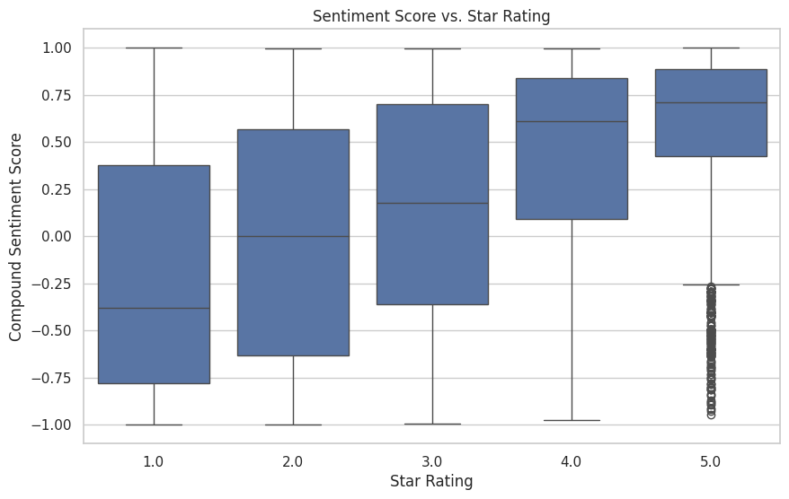
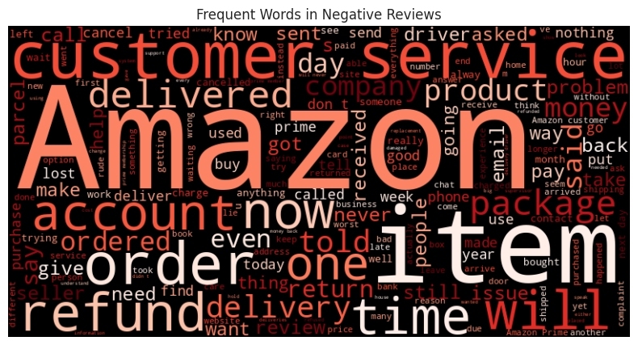
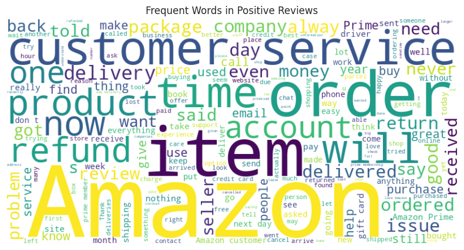

# 🛒 Amazon Reviews Sentiment Analysis

This project analyzes Amazon product reviews using Natural Language Processing (NLP), focusing on sentiment analysis with the VADER tool. It reveals how customer opinions in text relate to their given star ratings.




---

## 📂 Dataset

The dataset is sourced from Kaggle: [dongrelaxman/amazon-reviews-dataset](https://www.kaggle.com/datasets/dongrelaxman/amazon-reviews-dataset)

---

## 📌 Features

- ✅ Load and clean Amazon review data  
- 🧠 Perform sentiment analysis using VADER (NLTK)  
- 📊 Visualize sentiment vs star ratings  
- 🔍 Detect mismatched sentiment/rating reviews  
- ☁️ Generate WordClouds for positive and negative reviews  

---

## 📦 Requirements

Install all required packages:

```bash
pip install pandas kagglehub nltk seaborn matplotlib wordcloud
